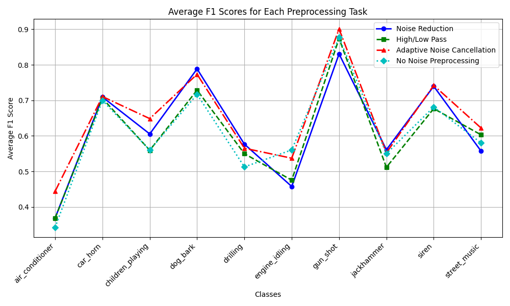

This project tests different types of denoising to improve the classification of low SNR classes in the UrbanSound8K dataset. The model used to test these strategies had convolutional layers and an LSTM layer. 

Dataset Link: 
- https://urbansounddataset.weebly.com/urbansound8k.html 

Paper pending

Final Results 

